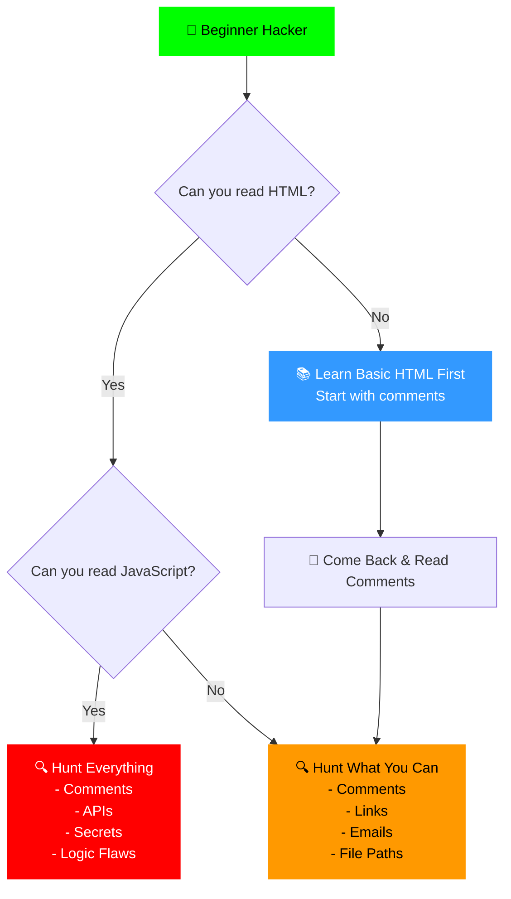

# 🟢 CURL — The Hacker's First Recon Tool

> **"Every hacker's journey begins with CURL."**  
> *Client URL The Silent Spy of Your Terminal*

---

## 🤔 What Is CURL?

**CURL** (Client URL) is a command-line tool used to transfer data to and from servers. It lets you communicate with websites and APIs directly from your terminal — no browser needed.

Think of it as:
- 🕵️ A **spy** that silently fetches website data
- 📡 A **messenger** that sends requests to servers
- 🔍 A **reconnaissance tool** that discovers hidden information

---

## 🎯 Why CURL? (The Rebel's Answer)

| Without CURL | With CURL |
|--------------|-----------|
| Open browser → Click → Open DevTools → Network tab | Terminal → One command → All data |
| Takes ~30 seconds per request | Takes ~1 second |
| Manual, slow, visible | Automated, fast, scriptable |

> **CURL turns your terminal into a browser — minus the bloat.**

---

## 📊 What Can You Do With CURL?

| # | Capability | Real-World Use |
|---|------------|----------------|
| 1 | Fetch web pages | Extract HTML source code |
| 2 | Send data (POST) | Submit forms, test logins |
| 3 | Custom headers | Spoof identity, bypass filters |
| 4 | Upload files | Test file upload vulnerabilities |
| 5 | Download files | Retrieve documents, scripts, backups |
| 6 | Follow redirects | Trace link destinations |
| 7 | API testing | Interact with REST APIs |
| 8 | Reconnaissance | Find hidden paths, emails, tech stack |
| 9 | Cookie handling | Steal, save, and reuse sessions |
| 10 | Automation | Send thousands of requests in minutes |

---

## 🗺️ Reconnaissance Types With CURL

| Type | Description | Risk Level | Example |
|------|-------------|------------|---------|
| 🟢 **Passive** | Information gathered without touching the target | Zero | DNS lookups, archive searches |
| 🔴 **Active** | Direct requests sent to the target server | IP gets logged | Header checks, hidden file discovery |

---

## 🔥 The Magic of One Command

> **Just `curl https://target.com` and you've already started hacking.**

---

### 🧠 Prerequisite: Read The Code

Before you start, understand this:

| Skill | Why It's Important |
|-------|---------------------|
| **Basic HTML** | Understand page structure — where things are |
| **Basic CSS** | Identify themes, frameworks, hidden elements |
| **Basic JavaScript** | Find API calls, secrets, logic flaws |
| **Read Comments** | Even if you know nothing — **READ COMMENTS!** |

> **Don't know coding? At least learn to read comments (`<!-- -->`). Developers often leave passwords, TODO notes, and sensitive info in comments!**

---

### 📦 What You Get With ONE Simple CURL Request

Running just `curl https://target.com` without any flags gives you:

| # | What You Get | Where It Lives | Example | Hacker's Use |
|---|--------------|----------------|---------|--------------|
| 1 | **Full HTML Source Code** | Entire response `<html>...</html>` | Complete page structure | Find hidden fields, forms, endpoints |
| 2 | **Hidden Comments** | Anywhere in HTML: `<head>`, `<body>`, `<footer>` | `<!-- TODO: fix password -->` | Developer notes, credentials, clues |
| 3 | **All Internal Links** | Inside `<body>` mostly, sometimes `<head>` | `/admin`, `/backup`, `/config` | Discover hidden directories |
| 4 | **JavaScript File Paths** | `<script src="...">` in `<head>` or end of `<body>` | `/js/main.js`, `/static/app.js` | Find API endpoints in JS files |
| 5 | **CSS File Paths** | `<link href="...">` inside `<head>` | `/css/style.css` | Understand page structure |
| 6 | **Image Paths** | `` inside `<body>` | `/images/logo.png`, `/uploads/` | Find upload directories |
| 7 | **API Endpoints** | Inside `<script>` tags or JS files | `/api/users`, `/v1/login` | Direct API access points |
| 8 | **Form Actions** | `<form action="...">` inside `<body>` | `<form action="/login">` | Know where data gets sent |
| 9 | **Hidden Input Fields** | `<input type="hidden">` inside `<form>` in `<body>` | `<input type="hidden" name="token">` | CSRF tokens, secrets |
| 10 | **Email Addresses** | Scattered in `<body>` (footer, contact sections) | `admin@target.com` | Social engineering targets |
| 11 | **Technology Stack** | File paths, comments, `<meta>` tags | `wp-content`, `php`, `react` | Identify CMS, frameworks |
| 12 | **Version Numbers** | JS/CSS file names, `<meta>` tags, comments | `jquery-3.2.1.min.js` | Find outdated vulnerable libraries |
| 13 | **Metadata** | `<meta>` tags inside `<head>` | Title, description, author | Application context |
| 14 | **CDN Links** | `<script src="cdn.example.com">` in `<head>` or `<body>` | Cloudflare, Akamai URLs | Identify infrastructure providers |
| 15 | **Tracking IDs** | `<script>` tags usually in `<head>` | `UA-123456-1` (Google Analytics) | Track owner's other websites |
| 16 | **Error Messages** | Anywhere — `<body>`, inline scripts, comments | Stack traces, debug info | Server paths, database errors |
| 17 | **Cookie Information** | `Set-Cookie` in response headers (use `-I` flag) | Session cookies | Understand authentication |
| 18 | **Redirect Logic** | `<meta http-equiv="refresh">` in `<head>`, or JS redirects in `<body>` | Meta refresh, JS redirects | Follow the flow |
| 19 | **IFrame Sources** | `<iframe src="...">` inside `<body>` | Embedded external content | Additional attack surface |
| 20 | **CORS Headers** | Response headers (use `-I` flag) | `Access-Control-Allow-Origin` | Understand API access rules |

---


---

### 🎯 Why Comments Are Gold (Even For Beginners)

```html
<!-- Real examples found in the wild: -->

<!-- TODO: change password from admin123 -->
<!-- Database: users_db, Table: accounts -->
<!-- Fixed in version 2.1 — remove this after testing -->
<!-- <form action="/debug/login"> -->
<!-- API key for testing: sk-test-123456 -->
<!-- Old admin panel: /old-admin — remove before launch -->

### 🧭 Beginner's Guide: What Should You Look For?


